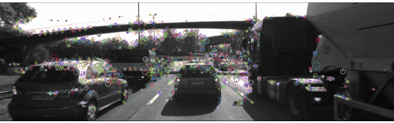

# SFND 2D Feature Tracking

[//]: # (Image References)

[image1]: ./images/readme_images/ring_buffer.png "Ring Buffer"
[image2]: ./images/readme_images/get_pop.png "Get & Pop"
[image3]: ./images/readme_images/akaze.png "Akaze"
[image4]: ./images/readme_images/Brisk.png "Brisk"
[image5]: ./images/readme_images/Fast.png "Fast"
[image6]: ./images/readme_images/Harris.png "Harris"
[image7]: ./images/readme_images/orb.png "ORB"
[image8]: ./images/readme_images/ShiTomasi.png "ShiTomasi"
[image9]: ./images/readme_images/sift.png "Sift"
[image10]: ./images/readme_images/ORB_AND_ORB.png "ORB and ORB"
[image11]: ./images/readme_images/focus_on_car.png "Focus on car"
[image12]: ./images/readme_images/distanceratio.png "Distance Ration"
[image13]: ./images/readme_images/AKAZE_AND_AKAZE.png "AKAZE and AKAZE"

# Project Overview
Bellow I will address each point in the [project rubric](https://review.udacity.com/#!/rubrics/2549/view) regarding the implementation of the project and the statistics measurements

## MP.1 Data Buffer Optimization
For memory optimization instead of a std::vector for storing incoming images a ring buffer is used. The implementation of the ring buffer can be found at `./src/ring_buffer.h` file. It is implemented as a template class and in the project it is instantiated with the DataFrame structure an a size of 3. The ring buffer has two indexes: head & tail. The mechanism is the following: 

- The images are inserted in the buffer at the position of the head 
- With each new image inserted we advance the head index and scale it with the size of the buffer
- The images are read from the buffer at the position of the tail 
- With each image read from the buffer we advance the tail index and scale it with the size of the buffer

![alt text][image1]

When an incoming images arrives and its keypoints are extracted the image is inserted in the buffer. When the buffer size is greater or equal to two we proceed with the keypoint matching. In this implementation there is one modification to the ring buffer that is different from the standard ring buffer implementation. The mechanism for reading images is separated into two methods: get & pop. The get method returns a pointer to the image in the ring buffer at tail position without advancing the tail. The pop method only advances the tail index without returning the image. This is done because of the keypoint matching step.  

![alt text][image2]

The idea is that in the keypoint matching step we read the current frame from the ring buffer and remove it then read the next frame but without removing it. We need to keep the next frame for the next iteration of the keypoint matching step where it will be the current frame. 

## MP.2 Keypoint Detection
In this project a variety of detectors are implemented. They are selectable through the `std::string detector_type` parameter. In an invalid detector is selected the program will throw an exception. The detectors implemented are:  
- SHITOMASI
![alt text][image8]
- HARRIS
![alt text][image6]
- FAST
![alt text][image5]
- BRISK
![alt text][image4]
- ORB
![alt text][image7]
- AKAZE
![alt text][image3]
- SIFT
![alt text][image9]

## MP.3 Keypoint Removal
In the images above we see that each detector detects the keypoints in all the regions of the image. In order to focus on the keypoints of the car in front of our ego vehicle a simple filtration is implemented using OpenCV Rect class that represents the bounding box and if a keypoint is outside that are we disregard it. 

![alt text][image11]

## MP.4 Keypoint Descriptors
In this project the following keypoint descriptors are implemented: BRISK, BRIEF, ORB, FREAK, AKAZE and SIFT. They are selectable through the `std::string descriptorType` function parameters.

## MP.5 Descriptor Matching
In the project there is a selection for matchers and selectors for keypoint matching. Available matchers are: FLANN and Brute Force. And the available selectors are: Nearest Neighbor and K-Nearest Neighbor (with the KNN being calibrated to two best matches).

![alt text][image10]
## MP.6 Descriptor Distance Ratio
As part of hte KNN selector a distance ratio test is implemented. The test iterates through the two output vectors of the KNN selector an chooses the match that fall under the desired threshold. In the implementation the threshold values is set to 0.8. Bellow is the result of the distance ratio test

![alt text][image13]
## MP.7 Performance Evaluation 1
In the table bellow we have the number of keypoints detected for the preceding vehicle for all 10 images and for all the detector types. Based on this data the three detectors that have returned the most keypoints are: AKAZE, BRISK and FAST.

Detector Type  |  Img. No. 1 |  Img. No. 2 |  Img. No. 3 |  Img. No. 4 |  Img. No. 5 |  Img. No. 6 |  Img. No. 7 |  Img. No. 8 |  Img. No. 9 |  Img. No. 10
-------------  | :---------: | :---------: | :---------: | :---------: | :---------: | :---------: | :---------: | :---------: | :---------: | :---------:
SHITOMASI      | 125         | 118         | 123         | 120         | 120         | 113         | 114         | 123         | 111         | 111
HARRIS         | 17          | 14          | 18          | 21          | 26          | 43          | 18          | 31          | 26          | 34
FAST           | 149         | 152         | 150         | 155         | 149         | 149         | 156         | 150         | 138         | 143
BRISK          | 160         | 164         | 158         | 162         | 159         | 156         | 161         | 155         | 160         | 142
ORB            | 92          | 102         | 106         | 113         | 109         | 125         | 130         | 129         | 127         | 128
AKAZE          | 166         | 157         | 161         | 155         | 163         | 164         | 173         | 175         | 177         | 179
SIFT           | 138         | 132         | 124         | 137         | 134         | 140         | 137         | 148         | 159         | 137

## MP.8 Performance Evaluation 2
In the table bellow we see the total number of matched keypoints for all 9 match instances using all possible detector-descriptor combinations. In the horizontal axis the descriptors are listed, and in the vertical the detectors.  
Descriptor/Detector Type  |     BRISK   |     BRIEF   |      ORB    |     FREAK   |     AKAZE   |  SIFT 
-------------             | :---------: | :---------: | :---------: | :---------: | :---------: | :---------: 
SHITOMASI                 | 81          | 89          | 85          | 63          | N.A.        | 68         
HARRIS                    | 13          | 16          | 16          | 13          | N.A.        | 14          
FAST                      | 87          | 98          | 96          | 71          | N.A.        | 81         
BRISK                     | 90          | 90          | 69          | 78          | N.A.        | 42         
ORB                       | 81          | 52          | 59          | 40          | N.A.        | 47         
AKAZE                     | 124         | 121         | 103         |108          | 140         | 97         
SIFT                      | 60          |  65         | N.A.        | 53          | N.A.        | 51         

## MP.9 Performance Evaluation 3
In the table bellow we see the average processing time for all detector-descriptor combination applied and averaged on all 10 input images. In the horizontal axis the descriptors are listed, and in the vertical the detectors. Based on these results we can make a proposition that the top 3 fastest detector-descriptor combinations are: FAST + BRIEF, FAST + ORB, FAST + SIFT. 

Descriptor/Detector Type  |     BRISK   |     BRIEF   |      ORB    |     FREAK   |     AKAZE   |  SIFT 
-------------             | :---------: | :---------: | :---------: | :---------: | :---------: | :---------: 
SHITOMASI                 | 44.9067     | 21.992      | 17.8674     | 34.1482     | N.A.        | 21.7399         
HARRIS                    | 39.4661     | 15.5394     | 18.4634     | 34.9929     | N.A.        | 21.5843         
FAST                      | 26.8315     | 2.95946     | 5.83626     | 23.9629     | N.A.        | 14.1271         
BRISK                     | 65.4532     | 43.3297     | 57.4566     | 61.351      | N.A.        | 62.7616         
ORB                       | 45.7163     | 23.4924     | 38.2593     | 41.8519     | N.A.        | 52.4007        
AKAZE                     | 81.7695     | 59.1585     | 65.3632     | 75.1802     | 96.4652     | 67.0839         
SIFT                      | 96.7775     | 72.9121     | N.A.        | 90.2254     | N.A.        | 117.035      
## Dependencies for Running Locally
* cmake >= 2.8
  * All OSes: [click here for installation instructions](https://cmake.org/install/)
* make >= 4.1 (Linux, Mac), 3.81 (Windows)
  * Linux: make is installed by default on most Linux distros
  * Mac: [install Xcode command line tools to get make](https://developer.apple.com/xcode/features/)
  * Windows: [Click here for installation instructions](http://gnuwin32.sourceforge.net/packages/make.htm)
* OpenCV >= 4.1
  * This must be compiled from source using the `-D OPENCV_ENABLE_NONFREE=ON` cmake flag for testing the SIFT and SURF detectors.
  * The OpenCV 4.1.0 source code can be found [here](https://github.com/opencv/opencv/tree/4.1.0)
* gcc/g++ >= 5.4
  * Linux: gcc / g++ is installed by default on most Linux distros
  * Mac: same deal as make - [install Xcode command line tools](https://developer.apple.com/xcode/features/)
  * Windows: recommend using [MinGW](http://www.mingw.org/)

## Basic Build Instructions

1. Clone this repo.
2. Make a build directory in the top level directory: `mkdir build && cd build`
3. Compile: `cmake .. && make`
4. Run it: `./2D_feature_tracking`.
